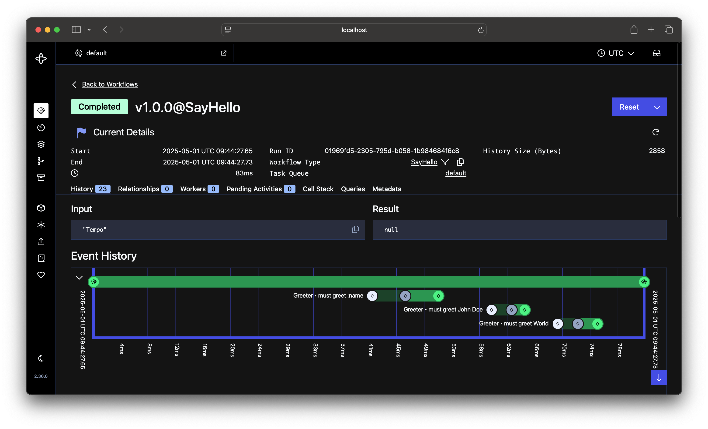
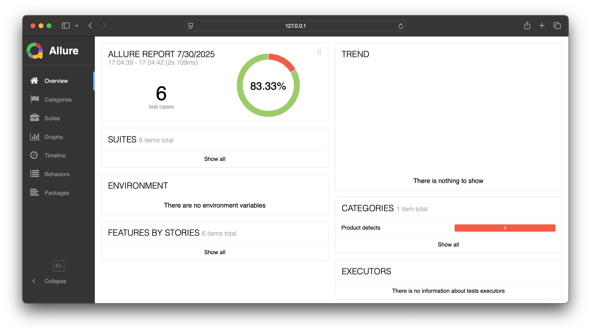

# Tempo

[](https://pkg.go.dev/github.com/cito-oss/tempo)
[](https://goreportcard.com/report/github.com/cito-oss/tempo)
[](https://codecov.io/github/cito-oss/tempo)

Tempo is a Go library for running Go-like tests in a distributed manner using Temporal.

## Usage

Add the dependency to your `go.mod` file:

```bash
go get github.com/cito-oss/tempo
```

> [!TIP]
> For more examples, check the [_example](/_example) directory.

Then create your first test app:

```go
package main

import (
	"context"

	"github.com/cito-oss/tempo"
	"github.com/stretchr/testify/assert"
	"github.com/stretchr/testify/require"
	"go.temporal.io/sdk/client"
	"go.temporal.io/sdk/worker"
)

func Greeter(ctx context.Context, name string) (string, error) {
	if name == "" {
		name = "World"
	}

	return "Hello " + name, nil
}

func SayHello(t *tempo.T, name string) {
	t.Run("must greet :name", func(t *tempo.T) {
		var greetings string

		err := t.Task(Greeter, name, &greetings)
		require.NoError(t, err)

		assert.Equal(t, "Hello "+name, greetings)
	})

	t.Run("must greet John Doe", func(t *tempo.T) {
		var greetings string

		err := t.Task(Greeter, "John Doe", &greetings)
		require.NoError(t, err)

		assert.Equal(t, "Hello John Doe", greetings)
	})

	t.Run("must greet World", func(t *tempo.T) {
		var greetings string

		err := t.Task(Greeter, "World", &greetings)
		require.NoError(t, err)

		assert.Equal(t, "Hello World", greetings)
	})
}

func main() {
	cli, err := client.Dial(client.Options{})
	if err != nil {
		panic(err)
	}
	defer cli.Close()

	queue := "default"

	// WORKER
	myworker := worker.New(cli, queue, worker.Options{})

	tempo.Worker(myworker, tempo.Registry{
		Tests: []tempo.Test{
			tempo.NewTestWithInput(SayHello),
		},
		Tasks: []tempo.Task{
			Greeter,
		},
	})

	// non-blocking call
	err = myworker.Start()
	if err != nil {
		panic(err)
	}
	defer myworker.Stop()
	// /WORKER

	// RUNNER
	myrunner := tempo.NewRunner(cli, queue,
		tempo.NewPlan(SayHello, "Tempo"),
	)

	myrunner.SetReport(true) // enable Allure reporting

	// blocking call
	err = myrunner.Run("v1.0.0")
	if err != nil {
		panic(err)
	}
	// /RUNNER
}
```

Now run it and check your Temporal:



## Reporting

If you are using the runner, enabled it with:

```go
	myrunner.SetReporting(true)
```

or if you are invoking tests manually:

```go
	opts := []tempo.Option{
		tempo.WithReporting(true),
	}

	err := tempo.Run(cli, queue, id, plan, nil, opts...)
```

Then, run your tests. Once they are completed, you will notice that an `allure-results` folder has been created. You can now generate and view the report using the following commands:

```shell
allure generate allure-results --clean -o allure-report
allure open allure-report
```




> [!IMPORTANT]
> Please note that reporting is handled by the runner. So, if you have separate applications for the runner and worker, the `allure-results` folder will be created where the runner is being executed.

## Roadmap

- [x] Reporting
- [ ] Slack integration
- [ ] Support to Temporal Signals
- [ ] Ability to Skip test cases
